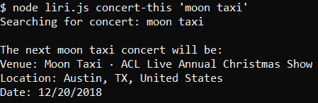
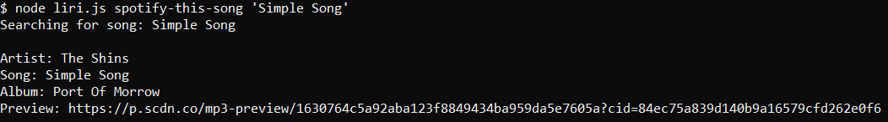
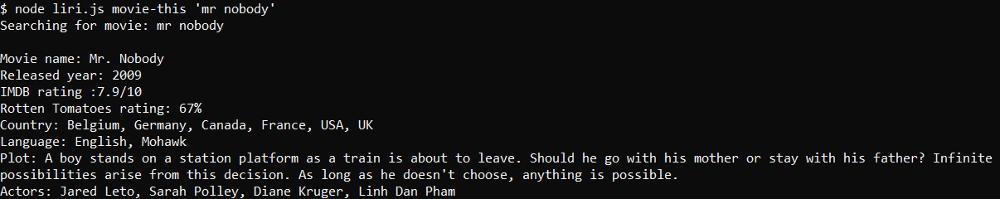
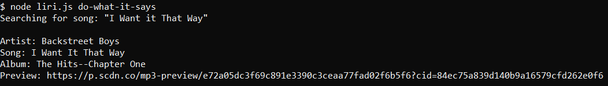

# liri-node-app

### Use

LIRI is a Node app that takes arguments in command line and searches Spotify, The Online Movie Database, and Bands In Town for information based on the command given.

### Requirements

This app requires these Node packages:

* [Node-Spotify-API](https://www.npmjs.com/package/node-spotify-api)

* [Axios](https://www.npmjs.com/package/axios)

* [Moment](https://www.npmjs.com/package/moment)

* [DotEnv](https://www.npmjs.com/package/dotenv)

This app also requires API keys for Spotify, OMDB, and Bands In Town. Create a .env file in the directory you download and put your keys in this format:

```
SPOTIFY_ID= PROJECT_ID
SPOTIFY_SECRET= PROJECT_SECRET

OMDB_ID= API_KEY

BANDS_ID= API_KEY
```

#### Instructions

This app takes 4 different commands:

* `concert-this` will search for concerts by band
* `spotify-this-song` will search Spotify for information by song name
* `movie-this` will search OMDB for information by movie name
* `do-what-it-says` will execute whatever command is stored in `random.txt`

### Examples





